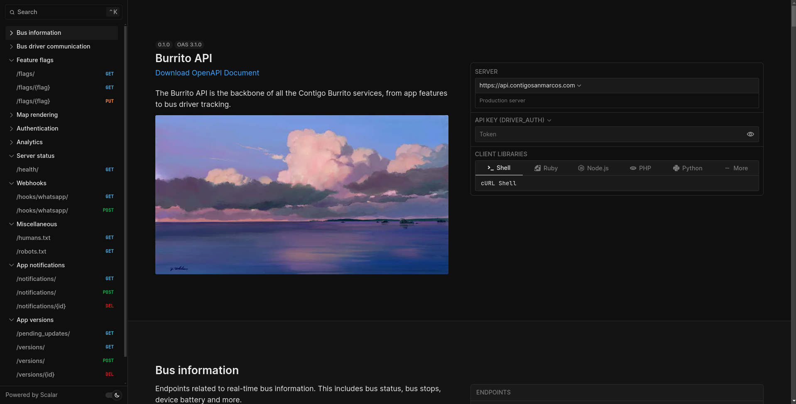

# API documentation

For the API documentation we followed a code-first approach. The documentation
is generated from the source code using [`utoipa`](https://github.com/juhaku/utoipa),
which generates an OpenAPI 3.1 specification file at compile time.

This specification is then consumed and rendered by
[Scalar](https://github.com/scalar/scalar). The final document result is served
by the API itself, and can be publicly accessed at `/docs`.



Live documentation is hosted in <https://api.contigosanmarcos.com/docs>.

## Documenting API endpoints

To document a route you use the `path` attribute macro from `utoipa`. This
macro takes several arguments to document the endpoint. The most important
are shown in this `PATCH /flag/id` example:

```rust,no_run,noplayground
#[utoipa::path(
    tag = docs::tags::APP_VERSIONS_TAG,
    description = "Edits an existing app version. All columns are optional.",
    request_body(content = schemas::AppVersionPatchPayload),
    responses(
        (status = 200, body = schemas::AppVersion),
        (status = 400),
        (status = 401),
    ),
    security(("staff_user_auth" = [])),
)]
#[patch("/<id>", format = "json", data = "<payload>")]
async fn patch_app_version(
    id: i32,
    _user: StaffUser,
    payload: JsonResult<'_, schemas::AppVersionPatchPayload>,
    state: &State<AppState>,
) -> ApiResponse<Json<schemas::AppVersion>> {
    // ...
}
```

Refer to the [utoipa::path](https://docs.rs/utoipa/latest/utoipa/attr.path.html)
documentation for more details.
